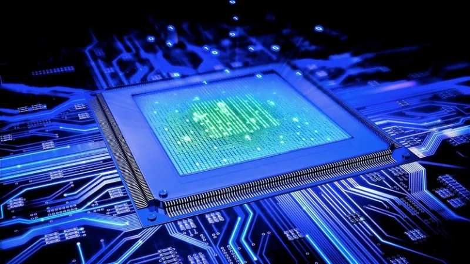

# Preguntas Orientadoras

## ¿Qué es un computador?.
Según la RAE, un computador es una máquina electrónica capaz de realizar un tratamiento automático de la información y de resolver con gran rapidez problemas matemáticos y lógicos mediante programas informáticos.

Fuente: [Compudator segun la RAE](https://www.rae.es/dpd/computador)

## Arquitecturas de un computador: CISC y RISC

La arquitectura de computadoras cumple un rol esencial en el diseño, funcionamiento y mejora de los sistemas informáticos. Su implementación permite la creación de sistemas óptimos y eficientes, incrementando el rendimiento y reduciendo los recursos requeridos. De hecho, una correcta arquitectura puede marcar la diferencia en lo que a velocidad, capacidad de respuesta y consumo de energía refiere.

- Arquitectura RISC (Reduced Instruction Set Computer):

Es un enfoque de diseño de procesadores y computadoras que se caracteriza por utilizar un conjunto de instrucciones reducido y altamente optimizado. Los procesadores RISC ejecutan instrucciones en un solo ciclo de reloj, lo que los hace más eficientes en operaciones simples y repetitivas. Además, pueden alcanzar altos niveles de rendimiento, siendo particularmente útiles en aplicaciones que requieren un procesamiento intensivo, como servidores y supercomputadoras.

- Arquitectura CISC (Complex Instruction Set Computer):

A diferencia de RISC, los procesadores CISC utilizan un conjunto de instrucciones más amplio y diverso. Estas instrucciones pueden realizar tareas más complejas en un solo ciclo de reloj, lo que facilita la programación, pero puede afectar el rendimiento en ciertos escenarios.

[Referencia Arquitectura de un PC](https://global.tiffin.edu/blog/que-es-arquitectura-de-computadoras)

## ¿Qué es el hardware?
1. CPU. Escribe una definición y sus partes más relevantes. 

La CPU es el componente principal que procesa las señales y hace posible la computación. Actúa como el cerebro de cualquier dispositivo de computación. Obtiene instrucciones de la memoria, realiza las tareas necesarias y envía la salida a la memoria. Maneja todo tipo de tareas de computación necesarias para que el sistema operativo y las aplicaciones se ejecuten.

    - ALU. Definición y función.

    La unidad aritmética lógica (ALU) realiza operaciones aritméticas básicas (suma, resta, multiplicación y división) y operaciones lógicas (AND, OR, y NOT) sobre los datos. Recibe datos de los registros de la CPU, los procesa según las instrucciones de la unidad de control y produce el resultado.

    - Unidad de control. Definición y función.

    La unidad de control gestiona el procesamiento de instrucciones y coordina el flujo de datos dentro de la CPU y entre otros componentes del ordenador. Tiene un componente decodificador de instrucciones que interpreta las instrucciones extraídas de la memoria y las convierte en micro operaciones que la CPU puede ejecutar.

    Registros. Definición y función.

Los registros son pequeñas ubicaciones de almacenamiento de memoria de alta velocidad dentro de la CPU. Contienen datos en los que la CPU está trabajando en ese momento y facilitan un acceso rápido a los datos. Las CPU tienen varios tipos de registros, como:

- Registros de uso general que contienen datos operativos
- Registros de instrucciones que contienen la instrucción actual que se está procesando
- Un contador de programas que contiene la dirección de memoria de la siguiente instrucción que se va a recuperar

 Buses. Definición y función.

 Dependiendo de la arquitectura de la CPU, puede haber una unidad de interfaz de bus o una unidad de gestión de memoria independientes. Estos componentes gestionan las tareas relacionadas con la memoria, como la gestión de la interacción entre la CPU y la RAM. También gestiona la memoria caché (una unidad de memoria pequeña y rápida ubicada dentro de la CPU) y la memoria virtual que la CPU necesita para el procesamiento de datos.

[Referencia CPU](https://aws.amazon.com/es/what-is/cpu/)

2. Memoria: se dice en la informática que es un dispositivo que retiene, memoriza o almacena datos durante algún periodo de tiempo.
    - Registros: Los registros son, básicamente, elementos de memoria de acceso rápido que se encuentran dentro del procesador. Constituyen un espacio de trabajo para el procesador y se utilizan como un espacio de almacenamiento temporal.
    - Caché: La memoria caché opera con mayor velocidad, dotando al microprocesador de un tiempo extra para acceder a los datos que se usan con más frecuencia.
    - Principal (RAM): La memoria RAM es una memoria volátil, ya que pierde información en la falta de energía eléctrica. Mientras, la memoria no volátil retendrá la información almacenada incluso si no recibe corriente eléctrica constantemente, como es el caso de la memoria ROM. Se usa para almacenamientos a largo plazo y, por tanto, se usa en memorias secundarias, terciarias y fuera de línea.
    - Secundaria (Disco duro y unidades externas de almacenamiento): La memoria secundaria o de almacenamiento masivo tiene mayor capacidad que la memoria primaria, pero es mucho más lenta. El tiempo necesario para acceder a un byte de información dado almacenado en un disco duro de platos magnéticos es de unas milésimas de segundo. 

[Referencia Memoria](https://www.euroinnova.com/blog/que-es-la-memoria-de-la-computadora)

[Referencia 2](https://aws.amazon.com/es/caching/)

[Referencia 3](https://cv.uoc.edu/annotation/98cc2745a4e06459733a5cd283281b8a/619469/PID_00218272/PID_00218272.html#w31aab9c13)

[Referencia 4](https://ayudaleyprotecciondatos.es/2020/07/23/memoria-cache/#Que_es_la_memoria_cache)

3. Dispositivos de entrada / salida

Los dispositivos de salida permiten al sistema informático mostrar información al usuario. Esta información puede ser en forma de texto, imágenes, audio, video o incluso comandos físicos. 

Los dispositivos de entrada, por otro lado, permiten al usuario ingresar información al sistema. Estos dispositivos también pueden presentar la información en diversos formatos, como texto, imágenes, audio o video.

[Dispositivos In/Out](https://www.inesem.es/revistadigital/informatica-y-tics/perifericos-de-salida-y-entrada/)

4. Buses de datos

Un bus de datos o bus bidireccional es un tipo de bus de comunicación en el que se transmiten los datos entre los diferentes componentes de una computadora o sistema. La información puede fluir en ambas direcciones, ya sea desde el ordenador hacia otros dispositivos, o desde los propios dispositivos hacia el ordenador.

Bus de direcciones:
- El bus de dirección es un componente separado del bus de datos en un sistema cuya función principal es transmitir la dirección de memoria de la información que se desea acceder o transmitir.

Bus de control:
- El bus de control es un componente esencial en un sistema de computadora que se encarga de controlar el acceso y el uso de las líneas de dirección y datos. Estas líneas son suministradas por dispositivos específicos que tienen el control sobre su uso.

Bus multiplexado:
- Los buses multiplexados permiten la transmisión de múltiples señales o datos a través de un único conjunto de líneas de comunicación (las señales se transmiten de manera secuencial a través del bus utilizando técnicas de multiplexación).

[Referencia Buses](https://advantecnia.com/tipos-de-buses-de-comunicacion/#:~:text=Un%20bus%20de%20datos%20o,propios%20dispositivos%20hacia%20el%20ordenador.)

5. GPU

La unidad de procesamiento de gráficos (GPU) es un circuito electrónico que puede realizar cálculos matemáticos a alta velocidad. Algunas tareas de computación, como la renderización de gráficos, el machine learning (ML) y la edición de videos, requieren la aplicación de operaciones matemáticas similares en un conjunto de datos grande. El diseño de una GPU le permite realizar la misma operación en varios valores en paralelo. Esto vuelve más eficiente el procesamiento de muchas tareas que requieren mucha capacidad de cómputo.

[Referencia GPU](https://aws.amazon.com/es/what-is/gpu/)

## ¿Qué es el software? 
Conocemos como software a un conjunto de instrucciones y procedimientos diseñados para que un dispositivo electrónico pueda cumplir funciones específicas. Aunque es común usar el término software para describir a los programas de computadora, en realidad engloba a todos los componentes intangibles dentro de un sistema informático.

 - Software de sistema: En esta categoría encontramos a los sistemas operativos y servidores encargados de ejecutar el hardware de un dispositivo. Además, son el principal medio de soporte para instalar y utilizar todo tipo de aplicaciones y programas informáticos.
 - Software de aplicación: Es frecuente preguntarse qué es software de aplicaciones, ya que es el tipo de software más utilizado. Se trata de paquetes informáticos que realizan tareas específicas, las cuales son ejecutadas por el usuario. Las apps del celular, navegadores o programas de diseño son algunos ejemplos.
 - Software de desarrollo: Proporcionar a los programadores herramientas como editores de texto, compiladores, enlazadores, depuradores y otras herramientas para crear código. 

[Referencia Software](https://www.epnewman.edu.pe/revista/que-es-software/)

[Referencia 2](https://www.ibm.com/mx-es/topics/software-development)

 ## Funcionamiento del computador:
 - ¿Qué procesos se llevan a cabo cuando se enciende una computadora?
  Durante el proceso de arranque, el sistema prueba el hardware, carga y ejecuta el sistema operativo y configura los dispositivos. Para arrancar el sistema operativo.
  La mayoría de los usuarios realizan un arranque de disco duro al iniciar el sistema para operaciones generales. El sistema encuentra toda la información necesaria para el proceso de arranque en su unidad de disco.

[Referencia Funcionamiento del Computador](https://www.ibm.com/docs/es/aix/7.2?topic=startup-boot-process)

 - ¿Qué sucede desde que ingreso un dato a través del teclado, hasta que veo el resultado de la operación en la pantalla?

Cuando ingresas un dato a través del teclado, este se convierte en una señal eléctrica que es enviada al procesador de la computadora. El procesador, a través del sistema operativo, gestiona la información y realiza la operación requerida. Luego, el resultado se envía a la tarjeta gráfica (GPU), que lo convierte en señales que controlan los píxeles de la pantalla. Finalmente, ves el resultado en la pantalla. Todo este proceso ocurre rápidamente, casi de manera instantánea.

[Referencia Input del usuario a la maquina](https://homepage.cs.uri.edu/faculty/wolfe/book/Readings/Reading06.htm#:~:text=Input%3A%20Getting%20Data%20from%20the,motions%20to%20on%2Dscreen%20action.)

 - ¿Cómo se codifican los datos internamente en el computador?

La mayoria de los sistemas informáticos actuales son sistemas digitales. Estos ordenadores digitales trabajan con información representada en binario, por lo tanto, es necesario codificar cualquier información que quiera ser procesada mediante un sistema informático en secuencias de unos y ceros. Esto se hace para que la información pueda ser procesada por la computadora. 

Diferentes tipos de información y sus codificaciones más habituales:

1. Numérica:
Enteros (binario natural, complemento a dos, BCD), coma flotante
2. Alfanumérica:
ASCII, Unicode (UTF-8, UTF-16)
3. Multimedia:
4. Audio (wav, aiff, mp3, ogg), Gráficos (png, jpeg, tiff), Video (mpeg)
5. Compresión:
Sin pérdida (GZIP, BZIP2, LHA), con pérdida (mp3, ogg, jpeg, mpeg)
6. Otros:
Cifrado de clave única, cifrado de clave pública, hash o resúmenes

[Referencia Codificacion de Datos](https://elpuig.xeill.net/Members/vcarceler/c1/didactica/apuntes/ud1/na3)
 
 - ¿Cuáles son las unidades de medida de datos en un computador? Bit, Byte, etc.

Así como usamos medidas para saber cuánto pesan o miden las cosas, también hay unidades de medida que te permiten calcular la capacidad de almacenamiento de información o procesamiento de datos. 
Las unidades de medida más usadas son el Bit, Byte, Kilobyte, Megabyte, Gigabyte y Terabyte. Para que entiendas cómo se relacionan estas unidades de medida entre sí, imagina esto:
Tienes un libro muy grande, y una sola letra de ese libro representa un Byte. Esta letra está compuesta por (8) ocho partes y cada una de esas partes se llama Bit.

Si juntas varias letras (bytes) formarías palabras, y con las palabras un párrafo, que aquí contaría como un Kilobyte con varios párrafos (Kilobytes) podrías conformar algunas páginas del libro, lo que podría ser un Megabyte y uniendo todas las páginas (megabytes), tendrías el libro completo, que puedes imaginar que es Gigabyte, Si unes ese libro a muchos otros libros (Gygabytes), tendrías una gran biblioteca que, en este caso, equivaldría a un Terabyte. 

Bit: Es la unidad mínima de información empleada en informática. 

Byte (B): Equivale a 8 bits. Con dos bytes guardas o procesas una letra.

Kilobyte (kB):
1024 bytes forman un Kilobyte. 

Megabyte (MB):
Equivale a 1024 Kilobytes. 

Gigabyte (GB):
Es igual a 1024 Megabytes. 

Terabyte (TB):
Lo componen 1024 Gigabytes. Muchas veces esta medida determina la capacidad de almacenamiento de los discos duros. 

[Referencia Unidades de Almacenamiento](https://edu.gcfglobal.org/es/cultura-tecnologica/medidas-de-almacenamiento-de-informacion/1/)
