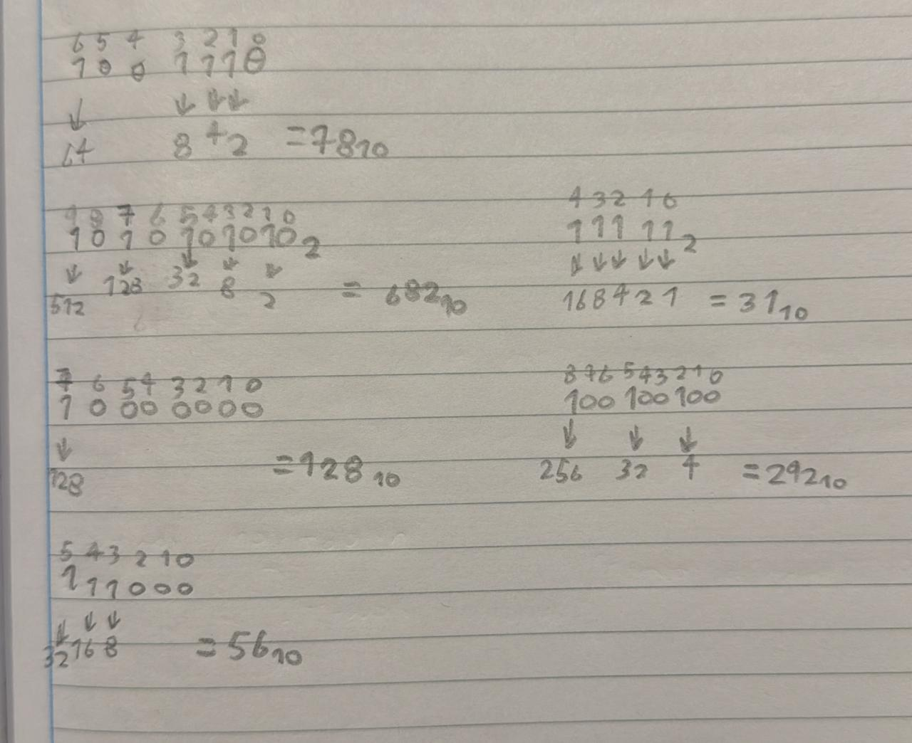
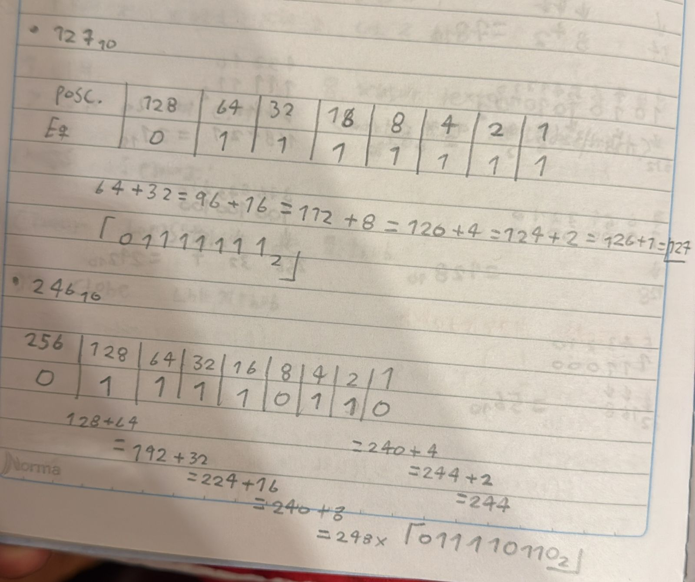
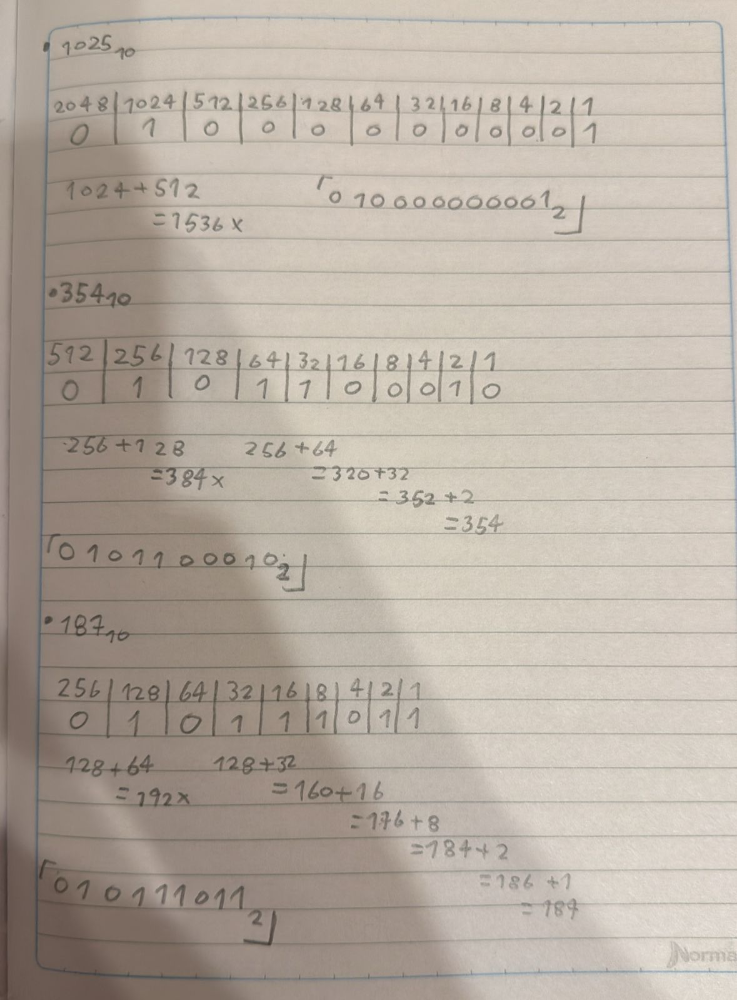
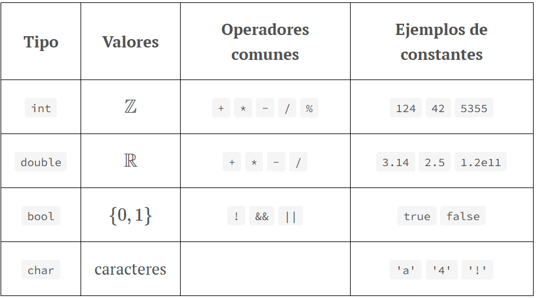
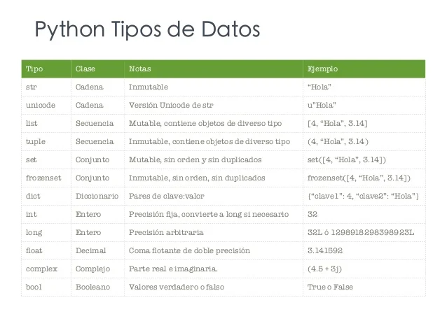
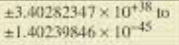
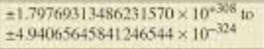
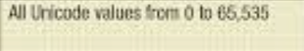
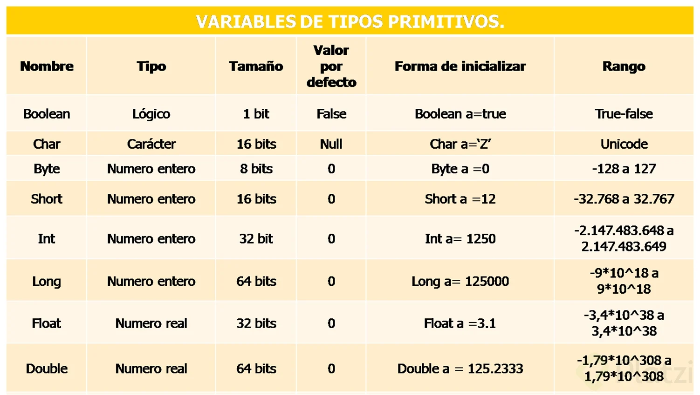
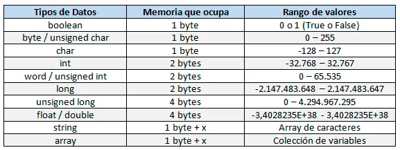

## Tareas consignadas para la bitacora en la Unidad2.Actividad2 

## Indice

[Actividad1](#actividad1-para-la-bitacora)

[Ejercicio 2 / Actividad 2](#ejercicio-2)

[Actividad 3](#3-actividad-de-investigación-para-la-bitácora)

[Actividad 4, Organización de resultados](#actividad-4-organización-de-resultados)

[Actividad 5, Ejercicio de cálculo de espacio en memoria](#actividad-5--ejercicio-de-cálculo-de-espacio-en-memoria)

## Actividad1. Para la bitacora 

- ### Escribe un párrafo explicando, en tus propias palabras, cómo se representan los datos en una computadora. Por ejemplo, ¿cómo se ingresan números, letras, imágenes a una computadora?

En una computadora, los datos se representan mediante un sistema binario, que usa combinaciones de ceros  y unos para codificar la información. Estos valores binarios corresponden a señales eléctricas que pueden estar encendidas o apagadas. Los números y las letras se convierten en estos bits mediante códigos estándar como el ASCII, que asigna un número binario específico a cada letra o símbolo. Las imágenes, por su parte, se descomponen en píxeles, donde cada píxel tiene un valor numérico que representa su color, también codificado en binario. De esta forma, cualquier tipo de dato, ya sea texto, imagen o sonido, puede ser convertido en secuencias de bits que la computadora puede procesar y almacenar.

- ### Luego de realizar el ejercicio 1, escribe tus conclusiones acerca de la pregunta planteada en la Figura 2. ¿Cuántos estados diferentes pueden ser representados por N variables binarias?

Se pueden representar N -esimos estados diferentes por que para cada valor que tome N, van a haber $2^N$ estados posibles.

- ### ¿Cuáles son las unidades de almacenamiento de datos que se utilizan en computación? Crea una tabla donde muestres estas unidades con sus prefijos. En este caso me refiero a KiloByte, MegaByte, etc. 

|Unidad de Almacenamiento|Prefijo|Valor equilvalente|
|----------|---------|-------|
|Kilobyte|KB|1024 bytes|
|Megabyte|MB|1024 Kilobytes|
|Gigabyte|GB|1024 Megabytes|
|Terabyte|TB|1024 Gigabytes|
|Petabyte|PB|1024 Terabytes|
|Exabyte|EB|1024 Petabytes|

Hay mas valores pero hasta ahora son los mas usados tanto en industria como en lo civil.

- ### Incluye un pequeño resumen, de un par de renglones, donde menciones la importancia del trabajo de George Bool en este tópico.

George Boole fue un matematico y logico cuyo trabajo sentó las bases del álgebra booleana, un sistema lógico fundamental para el desarrollo de la informática y la electrónica digital. Su enfoque matemático para representar la lógica permitió la creación de circuitos electrónicos y la programación computacional tal como la conocemos hoy.

## Ejercicio 2
Ahora es tu turno de intentar usar el método. Te voy a proponer varios números binarios y tú vas a convertirlos a decimales utilizando la `tabla 3`. Recuerda que el subíndice 2 significa que el número es binario (base 2)

- $1010101010_2$
- $11111_2$
- $10000000_2$
- $100100100_2$
- $111000_2$

Ahora es tu turno. Vas a convertir los siguientes  números decimales a binarios. Recuerda que el subíndice 10 significa que el número es decimal (`base 10`)

- $127_{10}$
- $246_{10}$
- $1025_{10}$
- $354_{10}$
- $187_{10}$

## **3. Actividad de investigación (para la bitácora)**

Investiga los diferentes tipos de datos que se utilizan en varios lenguajes de programación (por ejemplo, C, Java, Python). Ten en cuenta cómo cada lenguaje define los números enteros, los decimales (o flotantes), las letras del alfabeto, las cadenas de texto, valores booleanos, entre otros. Investiga qué nombres se asignan y qué abreviaciones se utilizan en cada lenguaje.

- Para C 

|Tipo|Tamaño en bits|Rango|
|---|---|---|
|char|8|-127 a 127|
|unsigned char|8|0 a 255|
|signed char|8|0 a 255|
|int|16|-32767 a 32767|
|unsigned int|16|0 a 65535|
|signed int|16|-32767 a 32767|
|short int|16|-32767 a 32767|
|unsigned short int|16|0 a 65535|
|float|32|6 digitos de precision|
|double|64|10 digitos de precision|
|long double|64|10 digitos de precision|
- Para python

|Tipo|Tamaño en bytes|Rango|
|---|---|---|
|byte|1|-128 a 127|
|short|2|-32768 a 32767|
|int |4|-2147483648 a 2147483647|
|long|8|-9.223.372.036.854.775.808 a -9.223.372.036.854.775.807|
|float|4||
|double|8||
|char|2||
|boolean|1 bit|Verdadero o Falso|

- Para Java

- Para C++

## Actividad 4 **Organización de resultados**

Con la información recolectada, organiza los datos en una tabla que incluya:

- **Nombre de la variable**
- **Abreviación (si existe)**
- **Características principales** (rango, tipo de valor, etc.)

|Nombre de la variable|Abreviación|Características|
|-------|-------|-------|
|integer|int|Guarda numeros enteros y positivos, variable numerica, permite almacenar caracteres numericos|
|Flotante|Float|Concentra muchos numeros, representa numeros reales|
|Doble precisión|Double|Contiene números de punto flotante de precisión doble IEEE de 64 bits (8 bytes) con signo cuyo valor oscila entre -1,79769313486231570E+308 y -4,94065645841246544E-324 para valores negativos y entre 4,94065645841246544E-324 y 1,79769313486231570E+308 para valores positivos. Los números de precisión doble almacenan una aproximación de un número real.|
|Carácter|char|Se encargan de almacenar aquellas variables cuyo identificador es un solo caracter.|
|Cadena|String|Aquellas variables que se encargan de almacenar palabras, así como una cadena de texto.|
|Arreglo|Array|Es una manera de poder guardar datos del mismo tipo o clase (Enteros, carácteres, booleanos, etc.).|
|Booleana|Bool|Permiten almacenar uno de los dos estados lógicos (verdadero o falso).|
|Larga|Long|Esta variable se encarga de almacenar todos aquellos datos que sean numéricos con muchos caracteres numéricos.|

### Actividad 5.  Ejercicio de cálculo de espacio en memoria.

