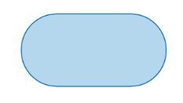
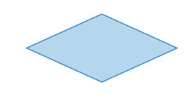
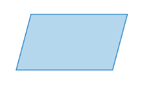
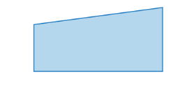
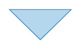
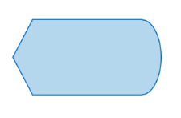
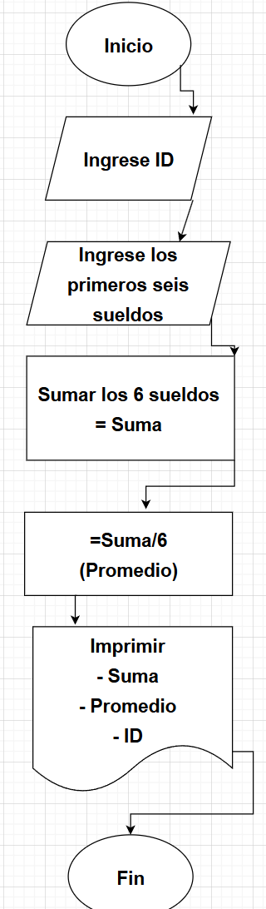

## Ejercicio 1

Investiga cuáles son los símbolos que se utilizan para representar cada operación de un algorimo con un diagrama de flujo. Asegúrate de que la fuente es confiable, discute lo que encontraste con tus compañeros y con el profe. Cuando estés seguro/a de tener los símbolos correctos, consigna la información en la bitácora.

### Símbolo de Inicio-Final

El símbolo de terminación marca el punto inicial o final del sistema. Por lo general, contiene la palabra "Inicio" o "Fin".

### Símbolo de acción o proceso

Un rectangulo solo puede representar un solo paso dentro de un processo ("agregar dos tazas de harina"), o un subproceso completo ("hacer pan") dentro de un proceso más grande.

### Símbolo del Documento Impreso

Sirve para representar textos.

### Símbolo de decisión o ramificación

Un punto de decisión o ramificación. Las líneas que representan diferentes decisiones surgen de diferentes puntos del diamante.

### Símbolo de entrada-salida

Representa el material o la información que entra o sale del sistema, como una orden del cliente (entrada) o un producto (salida).

### Símbolo de entrada manual

Representa un paso en el que se pide al usuario que introduzca la información manualmente.

### Símbolo de fusión

Indica un paso en el que dos o más sub-listas o subprocesos se convierten en uno.

### Símbolo de visualización

Indica un paso que muestra información.

## Ejercicio 2

Analicemos el siguiente problema y representemos su solución mediante un algoritmo secuencial.

- Construye un algoritmo que, al recibir como datos **el ID** del empleado y los seis primeros sueldos del año, calcule el ingreso total semestral y el promedio mensual, e imprima el ID del empleado, el ingreso total y el promedio mensual.

