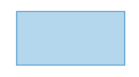
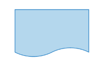

## Ejercicio 1

Investiga cuáles son los símbolos que se utilizan para representar cada operación de un algorimo con un diagrama de flujo. Asegúrate de que la fuente es confiable, discute lo que encontraste con tus compañeros y con el profe. Cuando estés seguro/a de tener los símbolos correctos, consigna la información en la bitácora.

### Símbolo de Inicio-Final

El símbolo de terminación marca el punto inicial o final del sistema. Por lo general, contiene la palabra "Inicio" o "Fin".

### Símbolo de acción o proceso

Un rectangulo solo puede representar un solo paso dentro de un processo ("agregar dos tazas de harina"), o un subproceso completo ("hacer pan") dentro de un proceso más grande.

### Símbolo del Documento Impreso

Sirve para representar textos.

### Símbolo de decisión o ramificación

Un punto de decisión o ramificación. Las líneas que representan diferentes decisiones surgen de diferentes puntos del diamante.

### Símbolo de entrada-salida

Representa el material o la información que entra o sale del sistema, como una orden del cliente (entrada) o un producto (salida).

### Símbolo de entrada manual

Representa un paso en el que se pide al usuario que introduzca la información manualmente.

### Símbolo de fusión

Indica un paso en el que dos o más sub-listas o subprocesos se convierten en uno.

### Símbolo de visualización

Indica un paso que muestra información.

## Ejercicio 2

Analicemos el siguiente problema y representemos su solución mediante un algoritmo secuencial.

- Construye un algoritmo que, al recibir como datos **el ID** del empleado y los seis primeros sueldos del año, calcule el ingreso total semestral y el promedio mensual, e imprima el ID del empleado, el ingreso total y el promedio mensual.

## Ejercicios 

## Consigna tus respuestas en la bitacora

A continuación, se presentan enunciados relacionados con los temas tratados en el texto. Los estudiantes deben responder si los enunciados corresponden o no con las definiciones o conceptos aprendidos.

### Parte 1: Identificar Algoritmos

Responde si los siguientes enunciados representan un algoritmo. Justifica la respuesta:

1. Una página web. _R/ Una pagina web no cumple con las caracteristicas de un algoritmo, no sigue una secuencia de pasos_ 
2. Una receta para hacer un pastel, donde se indican ingredientes y pasos a seguir. _R/ Este si sigue una secuencia de pasos, cumple con ser un algoritmo_
3. "Piensa en un número y multiplícalo por otro". _R/Es un algoritmo, siempre que yo le de las mismas entradas, me da las mismas salidas_
4. Un manual de instrucciones para armar un mueble, con pasos detallados y un orden claro. _R/ Tiene una secuencia de pasos, cumple con ser un algoritmo_
5. Una lista de compras organizada en orden alfabético _R/ Una lista de compras no es un algoritmo, no tiene finitud y siempre puede variar la lista_

### Parte 2: Variables y Constantes

Indica si las siguientes afirmaciones describen una variable o una constante:

1. El valor de la gravedad en la Tierra, 9.8 m/s². _R/Aunque su valor varía segun la ubicación en la tierra, siempre gira en torno al mismo valor, es una constante_
2. La edad de una persona calculada en base al año actual y su año de nacimiento. _R/ Es un valor variable porque la persona a medida que pase el tiempo, va a tener cada vez mas años_
3. La cantidad de dinero en una cuenta bancaria. _R/ Este es un valor que varía con el tiempo_
4. La velocidad de la luz en el vacío, 299,792,458 m/s. _R/ Es un valor constante porque en el vacio nada le ejerce fuerza_
5. El radio de un círculo. _R/Es una variable porque para cada valor de la circunferencia va a tener un resultado diferente_

### Parte 3: Características de los Algoritmos

Responde si los siguientes enunciados cumplen con las características de un algoritmo. Justifica la respuesta:

1. Para elegir la ruta más corta entre varias ciudades, el algoritmo examina rutas candidatas, deteniéndose cuando los cambios en la distancia parecen lo suficientemente pequeños. _R/ Para calcular la ruta mas corta entre ciudades, el algoritmo debe de seguir una serie de pasos finitos_
2. Suma los números ingresados y muestra el resultado. _R/ A pesar de parecer un algoritmo, es muy ambiguo porque no especifica como ingresar los datos._
3. Un conjunto de pasos para calcular el área de un rectángulo dado su base y altura. _R/ Dados los mismos inputs, entregará los mismos outputs_
4. El algoritmo cuenta el número de votos obtenidos por cada uno de los candidatos de una elección para presidente. Empieza solicitando el nombre del candidato y finaliza cuando se ingresa el valor -1. _R/ Es preciso y no deja ambiguedades a la hora de ingresar los datos, cumple con las caracteristicas de ser un algoritmo_

### Parte 4: Comprensión de Herramientas

Indica si las siguientes afirmaciones son ciertas o falsas respecto al pseudocódigo y diagramas de flujo:

1. El pseudocódigo utiliza símbolos estándar para representar las operaciones lógicas. __F__
2. Los diagramas de flujo son una representación gráfica de un algoritmo. __V__
3. El pseudocódigo debe estar escrito en un lenguaje de programación específico. __F__
4. Un diagrama de flujo siempre debe tener un inicio y un fin claramente definidos. __V__

### Parte 5: Estructuras de Control

Describe para qué sirven las estructuras de control. Redacta dos ejemplos, uno de tu vida diaria, es decir cuando tienes que tomar decisiones en tus actividades diarias y oto ejemplo en el que se tengan que utilizar cálculos matemáticos para tomar una u otra decisión.

__R/ Las estructuras de control sirven para tomar decisiones y hacer un proceso repetidas veces. Un ejemplo de la vida diaria es cuando voy algo tarde y tengo 2 opciones, si tomo el bus voy a llegar a tiempo ó unos minutos tarde mientras no gasto dinero de más pero si tomo un taxi, voy a llegar con algo de tiempo de sobra pero voy a gastar mucho mas dinero que habiendo tomado el bus.
Un ejemplo donde tenga que hacer calculos matemáticos es cuando tengo que calcular, por ejemplo, el precio de un articulo en una tienda con un descuento que aplica ese dia y compararlo con otros articulos similares con el mismo descuento y partir de su precio, escoger la opción mas economica__